# portfolio
 
A short portfolio showcases projects that were developed using Power Platform tools.

 alternative portfolio website: https://fabioc-gh.github.io/portfolio/

Power BI

    An overview of gym registrations.
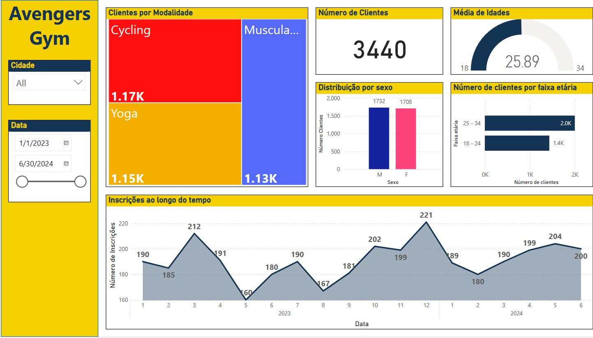

    Quarterly changes in gym membership
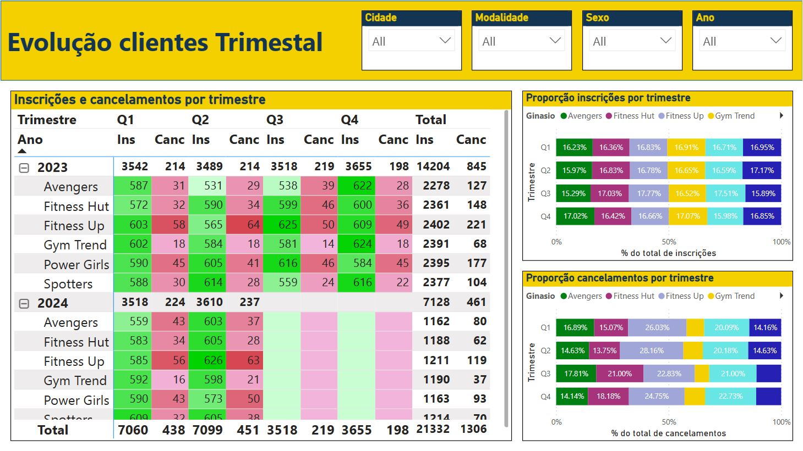

Power Apps

Tablet:

    Simple login page
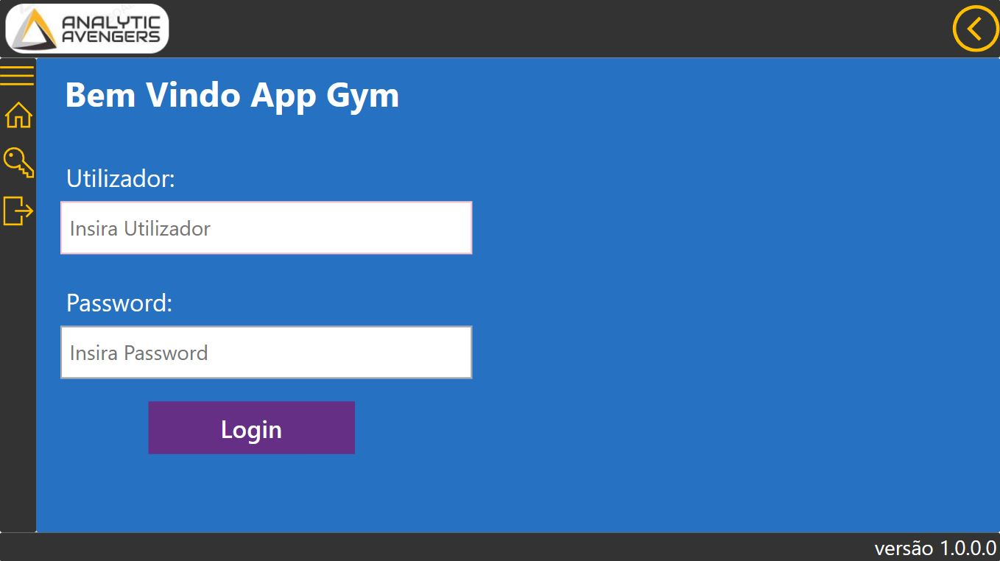

    The page for gym management is where occurrences are resolved
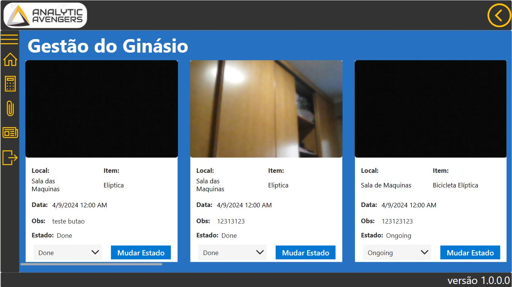

    Integration of Power BI reports into Power apps
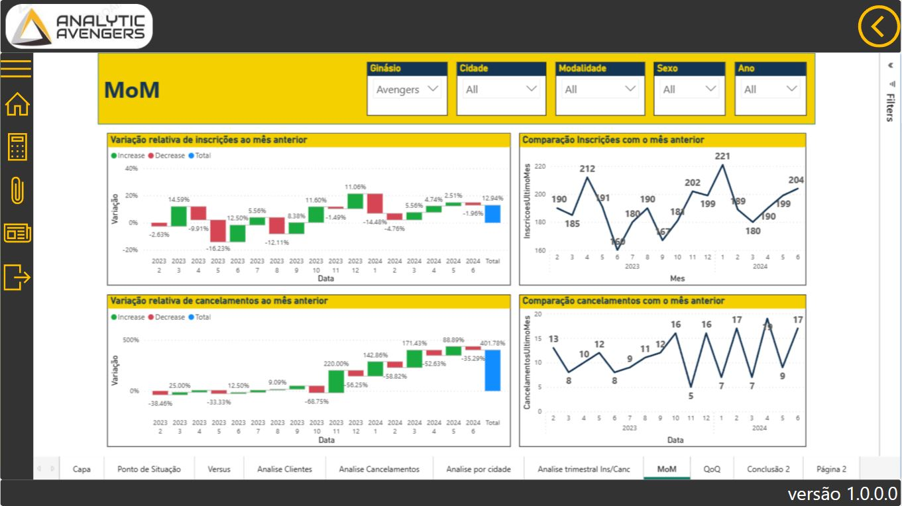

Mobile:

    A task list with a filter that allows the manager to add pictures
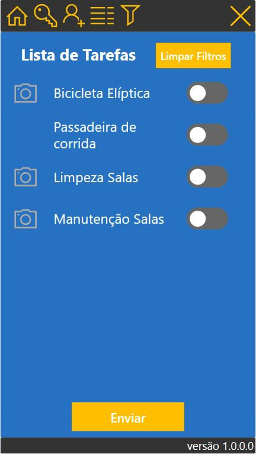

    Capture pictures of occurrences and send them to the gallery.
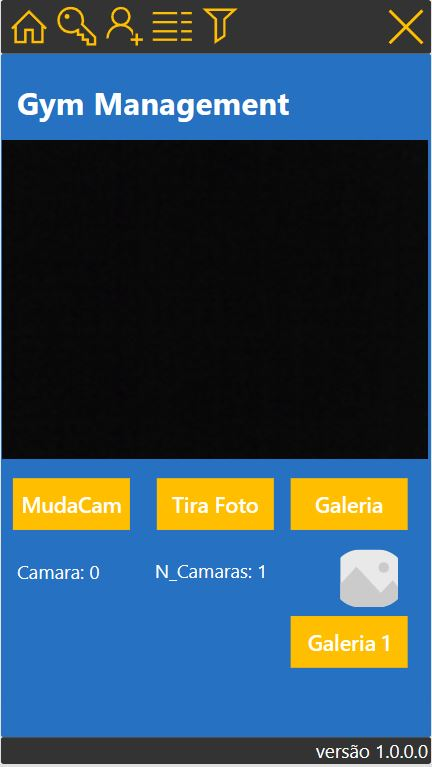

Power Automate
    Daily report of new entries in a database.
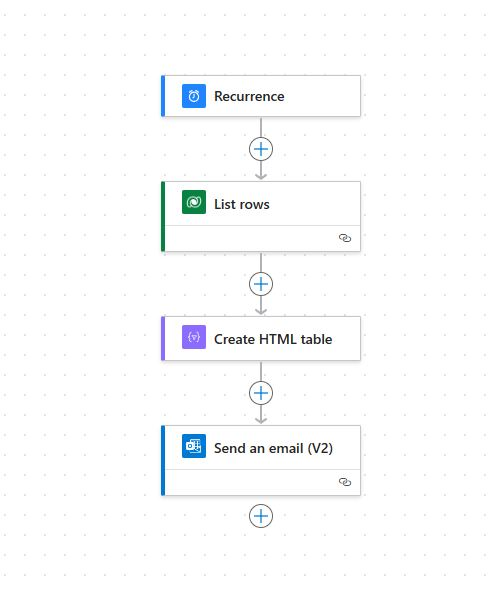

    Age confirmation flow
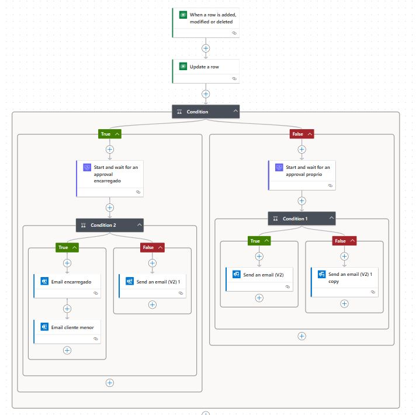

DataVerse

    Information is stored in a Dataverse table
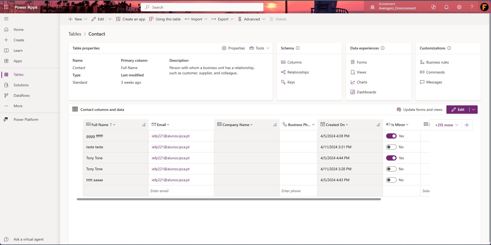

    Model-driven app using a Dataverse table.
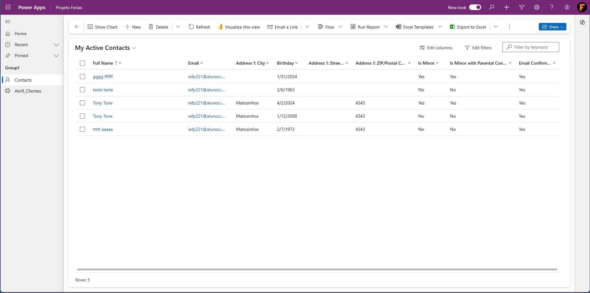

    Entering a new contact in the Model driven app
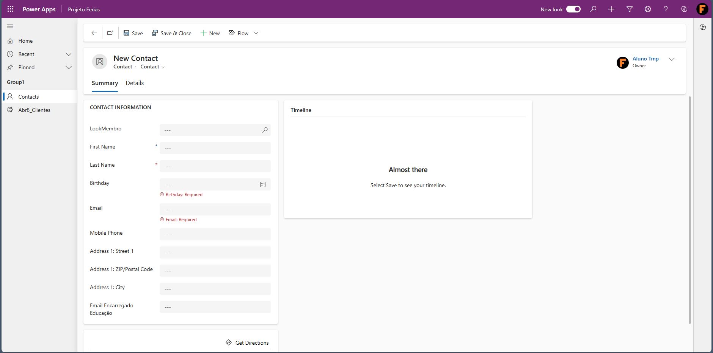
