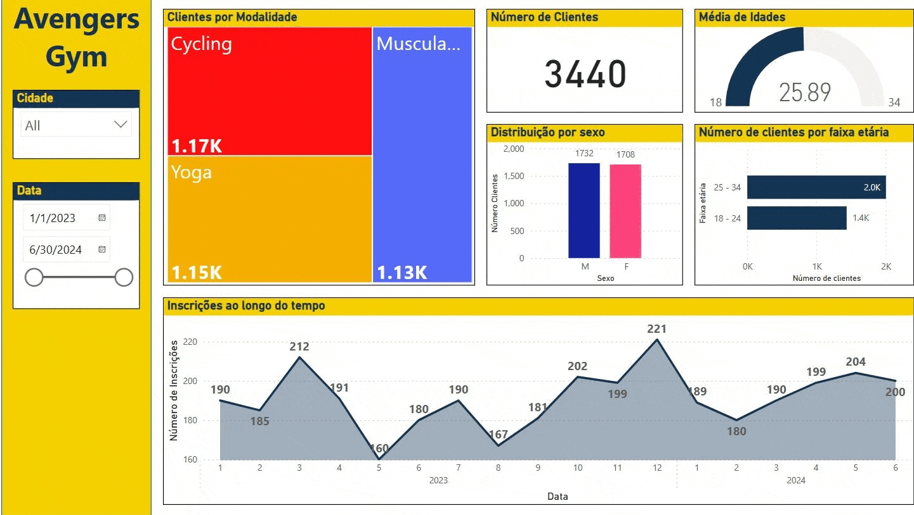
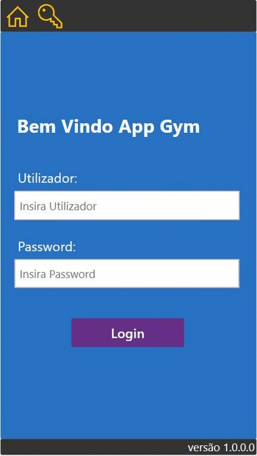
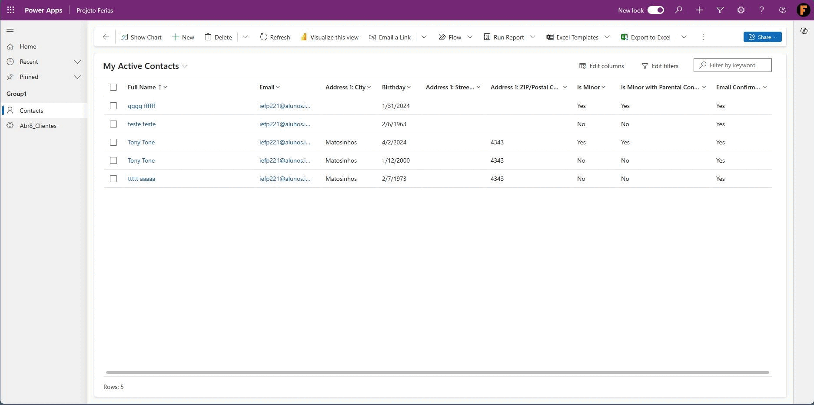

# portfolio

    About me
I'm Fábio, I have a degree in chemistry, this is a portfolio of projects developed while attending the course UPSkill PowerPlatform

A short portfolio showcases a project that was developed using Power Platform tools.

alternative portfolio website: https://fabioc-gh.github.io/portfolio/

    --
This project aims to create an application for a gymnasium. 
Offering power bi reports for better understanding the progression of membership evolution and gym locations performance. 
A power apps app was developed both in mobile and tablet versions for management the gym daily work and its employes. 
A simple model drive app, based on Dataverse tables was also developed for temporary promotions.

A chatbot named Gymbot was developed, it can answer questions about gym schedules of the various locations, and it also has a small store selling supplies, the information being stored in a sharepoint list.

Power BI

    An overview of gym registrations.

    Quarterly changes in gym membership.

    Slideshow of a Power BI report.

Power Apps

Tablet:    

    The page for gym management is where occurrences are resolved

    Integration of Power BI reports into Power apps

    Slideshow of the sreens in the tablet app.

Mobile:

    A task list with a filter that allows the manager to add pictures

    Capture pictures of occurrences and send them to the gallery.

    Slideshow of the sreens in the mobile app.

Power Automate
    Daily report of new entries in a database.

    Age confirmation flow

Model-driven app using DataVerse:

  Slideshow of the sreens in the Model-driven app.
  
