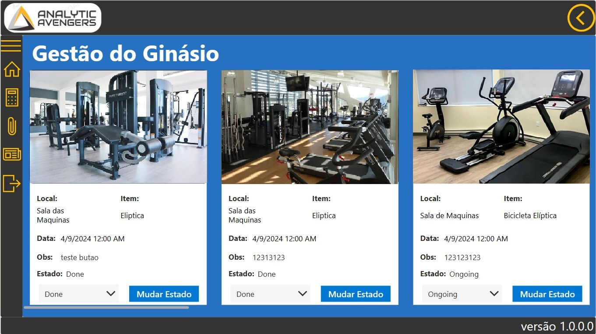

# portfolio
 
A short portfolio showcases projects that were developed using Power Platform tools.

 alternative portfolio website: https://fabioc-gh.github.io/portfolio/

Power BI

    An overview of gym registrations.

    Quarterly changes in gym membership

Power Apps

Tablet:

    Simple login page

    The page for gym management is where occurrences are resolved

    Integration of Power BI reports into Power apps

Mobile:

    A task list with a filter that allows the manager to add pictures

    Capture pictures of occurrences and send them to the gallery.

Power Automate
    Daily report of new entries in a database.

    Age confirmation flow

DataVerse

    Information is stored in a Dataverse table

    Model-driven app using a Dataverse table.

    Entering a new contact in the Model driven app

